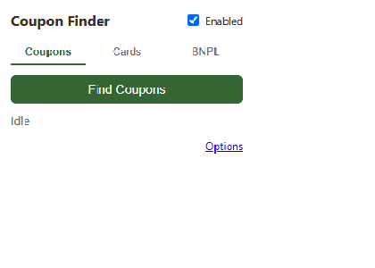

# Coupon Finder

[](https://github.com/2S9S8C4/Honey-Alternative/actions/workflows/ci.yml)

A Manifest V3 browser extension (Chrome + Firefox) that tries multiple coupon
codes at checkout and applies whichever gives the best discount, recommends
which of your credit cards earns the most rewards on the current site, and
detects which Buy Now / Pay Later services (Klarna, Afterpay, Affirm, PayPal
Pay in 4, Zip, Sezzle) are available on the page.



This started as a "build something like Honey" exercise and turned into a
case study in a problem that looks simple from the outside and isn't: **where
does the data actually come from, and is any of it free?** The README below
covers the architecture, and — more usefully — what building this surfaced
about coupon/rewards data sourcing that isn't obvious until you go looking.

## What it does

- **Coupons** — on a checkout page, detects the coupon/promo input field and
  "Apply" button, tries a list of candidate codes for the current domain one
  at a time, watches the page's total for a price change after each attempt,
  and leaves the best-performing code applied.
- **Cards** — you add your credit cards (nickname/network/issuer/reward rates
  only — no card numbers stored, this is an advisor, not autofill) and the
  popup ranks them by reward rate for a category guessed from the current
  site's domain (dining/travel/groceries/gas/general).
- **BNPL** — scans the current page for known Klarna/Afterpay/Affirm/PayPal
  Pay-in-4/Zip/Sezzle signatures (script hosts, class/data attributes, text)
  and lists whichever are present.

## Architecture

```
src/
  background/         service worker: message routing, coupon-trial
                       orchestration, card ranking, storage
    providers/         pluggable CouponProvider interface
                        (MockProvider, CouponApiOrgProvider)
  content/            runs on every page: coupon-field detection,
                       price watching, coupon-trial state machine,
                       BNPL signature detection
  popup/              toolbar UI (Coupons / Cards / BNPL tabs)
  options/            card management, provider config, excluded sites
  common/             shared types, message-passing contract, card/category
                       data
build/
  build.ts            esbuild multi-entry build -> dist/chrome, dist/firefox
                       (per-browser manifest merge: MV3 service_worker vs.
                       background.scripts)
tests/                vitest unit tests + a static local checkout fixture
                       used for end-to-end demoing without hitting a real site
```

Everything talks through a single discriminated-union `Message` type
(`src/common/messages.ts`) over `browser.runtime`/`browser.tabs` messaging —
popup and options never touch page DOM directly; only the content script
does, and only the background service worker owns cross-tab state and
storage.

## Why a `MockProvider` instead of live coupon data

The coupon-trying engine is fully functional and demoable, but by default it
runs against a bundled mock dataset rather than a live API. That wasn't
laziness — it's the honest answer to a question that turned out to have no
good answer: **there is no free, reliable, ongoing public API for real
coupon codes.**

What exists instead:

- **Affiliate networks** (Awin, CJ, Rakuten Advertising, Impact) are free to
  join (Awin has a refundable $1–5 anti-fraud deposit) and *are* how
  Honey/RetailMeNot actually source data — merchants upload their own codes
  to these networks. But access is gated behind per-merchant approval, which
  typically wants you to already have traffic, not a brand-new extension.
- **Aggregators** like CouponAPI.org just resell access to those same
  affiliate feeds, and only offer a 7-day trial, not an ongoing free tier.
- **Scraping a major aggregator directly doesn't work either** — tested this
  against RetailMeNot's Target page. The discount percentage is in the raw
  server HTML, but the actual code is hidden behind a "Show Code" button
  that links to a tracked `/out/O/{offer_uuid}` redirect, and their
  `robots.txt` explicitly disallows `/out/`, `/showcoupon/`, and (not a
  joke) `/opening_this_will_get_you_banned.php`. That's a deliberate
  anti-scraping mechanism tied to their affiliate-click monetization model,
  not an incidental JS-rendering hurdle.
- **Open-source coupon datasets on GitHub** turned out to be either generic
  fuzzing lists (a few dozen common codes like `SAVE10`, not merchant-real)
  or narrow single-retailer scrapers — no maintained cross-merchant database
  exists in the open-source ecosystem.

The `CouponProvider` interface (`src/background/providers/`) is built so any
of these can be plugged in later without touching the rest of the extension
— `CouponApiOrgProvider` already exists as a template for a real
subscription-backed source.

## Why no real card numbers

The card advisor stores nickname, network, issuer, and per-category reward
rates only. It's deliberately not a payment-autofill tool — no PCI exposure,
no encrypted-vault design to get right, no reason to ask a user to trust a
side-project extension with real card numbers. Built-in reward rates are a
static snapshot (not synced to real issuer terms, no rotating-category
support) and the popup/options copy says so; this is a *what should I use*
nudge, not financial advice.

## Competitive landscape (why this stayed a portfolio project)

Researching this seriously enough to build it well also surfaced why it's a
hard product to ship, not just a hard extension to build:

- **Coupons**: Honey lost ~8M Chrome Web Store users in early 2026 after an
  affiliate-link controversy, but SimplyCodes (500K+ stores, published 81.5%
  success rate), RetailMeNot, and Coupert are all more mature and better
  resourced than a project starting from a mock dataset.
- **Card rewards**: CardPointers and MaxRewards already do more than this
  project's static-metadata approach — real issuer-offer auto-activation,
  account linking, 1,000+ supported cards.
- **BNPL detection**: this is the one genuinely underserved niche — Klarna
  and Affirm each ship their own extension, but both are self-promotional
  (push their own payment option), not neutral detectors. If any piece of
  this were worth extending into a real product, it's this one.

## Development

```bash
npm install
npm run dev      # esbuild watch, builds dist/chrome and dist/firefox
npm run build    # production build (minified)
npm test         # vitest unit tests
npx tsc --noEmit # typecheck
```

Load `dist/chrome` via `chrome://extensions` → Load unpacked, or
`dist/firefox/manifest.json` via `about:debugging#/runtime/this-firefox` →
Load Temporary Add-on. `tests/fixtures/checkout.html` is a static page with a
working coupon-apply flow for testing without a live site.

## Stack

TypeScript, esbuild, `webextension-polyfill` (unified `browser.*` API across
Chrome/Firefox), vitest + jsdom for unit tests, Playwright for end-to-end
verification of the popup/content-script/background message flow.
